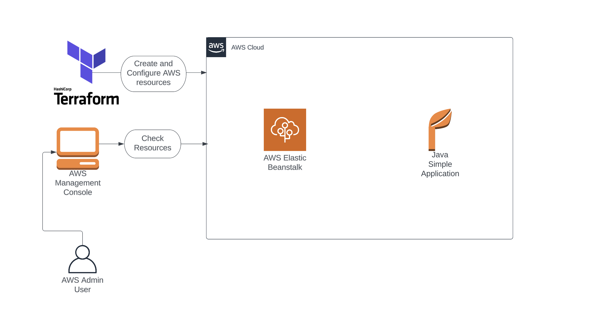
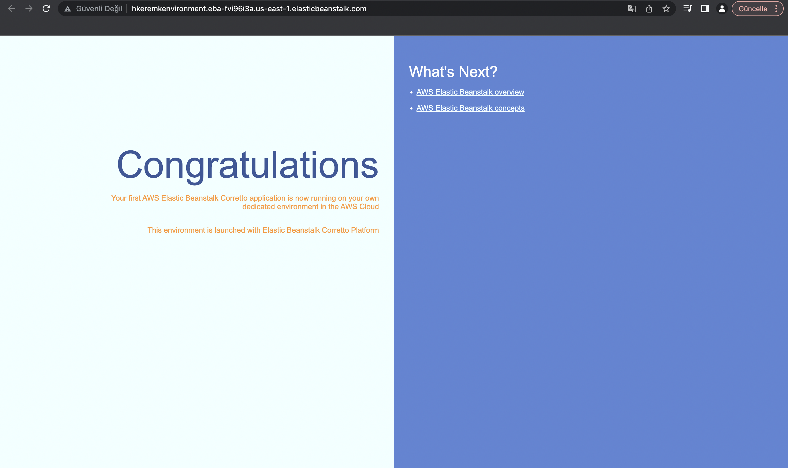

# Elastic Beanstalk Application using Terraform

You can test this project with this commands on your local machine.

- First, Initialize Terraform by running the below command:
```bash
  terraform init
```
- To generate the action plans run the below command:
```bash
  terraform plan
```
- To create all the resources declared in main.tf configuration file, run the below command:
```bash
  terraform apply
```
- To create all the resources declared in main.tf configuration file, run the below command:
```bash
  terraform destroy
```

<hr>
<br>






<hr>
<br>

## Task Details

1)Sign into AWS Management Console

2)Setup Visual Studio Code

3)Create a variables file

4)Create an Elastic BeanStalk Application in the main.tf file

5)Creating an Elastic environment in the main.tf file

6)Create an output file.

7)Confirm the installation of Terraform by checking the version.

8)Apply Terraform configurations

9)Check the resources in the AWS Console

10)Deletion of AWS Resources.
